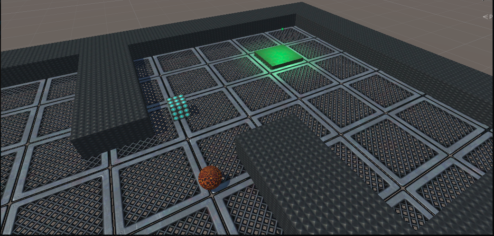

# change
Welcome to team *change*:
- C: collaborative
- H: human
- A: ai
- N: npc
- G: game
- E: environment

Team CHANGE Members: 
- LJ Arendse (@LJArendse)
- Christian Cecconi (@ChristianCecconi)
- Anna Dollbo (@dollbo)
- Vladyslav Ieliashevskyi (@vieliashevskyi)
- Björn P Mattsson (@Plankton555)

## objective
The aim of this project is to create a game domain which is centered around human-ai team collaboration.
In other words, creating a problem solving collaborative game environment where:
- there is a shared global goal between the human and agent.
- the domain should enforce collaboration between the human and ai agent, thus ensuring collaboration over optional cooperation
- regarding the problem solving effort, the human player is the leader and the ai agent is the companion assistant
  - i.e. whilst the human is hypothesizing and leading the problem solving effort, how should the companion agent assist and help? 

## technology
We are thinking of using the Unity ML toolkit and the Unity ML python API, in some way to build out the game and enable agent creation.

Unity ML links:
- Unity ML agents https://github.com/Unity-Technologies/ml-agents
  - ML agents overview: https://github.com/Unity-Technologies/ml-agents/blob/main/docs/ML-Agents-Overview.md
- Unity ML getting started: https://github.com/Unity-Technologies/ml-agents/blob/main/docs/Getting-Started.md
- How to create a new environment in Unity ML: https://github.com/Unity-Technologies/ml-agents/blob/main/docs/Learning-Environment-Create-New.md
  - environment examples: https://github.com/Unity-Technologies/ml-agents/blob/main/docs/Learning-Environment-Examples.md

## other collaborative game domains which inspired this project
- Minidungeons:
  - http://antoniosliapis.com/projects/project_minidungeons.php
  - gameplay: https://www.youtube.com/watch?v=8aRxeA2KA5A
- Portal 2 co-op mode
  - https://www.youtube.com/watch?v=A88YiZdXugA
- Dearth game domain
  - http://gambit.mit.edu/loadgame/dearth.php
  - gameplay: https://www.youtube.com/watch?v=fpMt3xs2Y9s
- Geometry Friends Coop Track
  - This game domain is from the "Conference on Games" (see https://ieee-cog.org/2020/competitions_conference and https://ieeexplore.ieee.org/document/7317949)
  - gameplay: https://www.youtube.com/watch?v=DBWUFRMw754

## Unity references
- Creating Your Level from a text file: https://learntocreategames.com/creating-your-level-from-a-text-file/

## Research on Human-AI Communication/Collaboration 
- https://www.aaai.org/AAAI21Papers/AAAI-8636.BansalG.pdf
- https://scholarspace.manoa.hawaii.edu/bitstream/10125/70652/0035.pdf
- https://dl.acm.org/doi/abs/10.1145/3415167
- https://arxiv.org/abs/2105.11000
- https://www.nature.com/articles/d41586-021-01170-0
