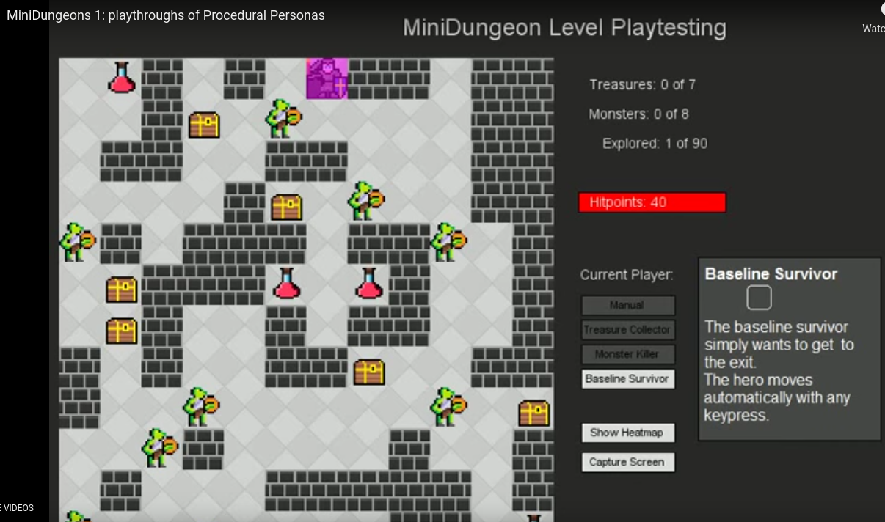
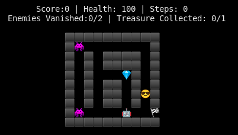
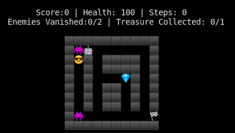
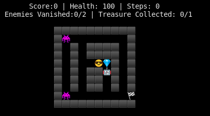

# Change: The Collaborative Dungeon Quest Game
- inspired by minidungeons (http://antoniosliapis.com/projects/project_minidungeons.php)
- Gridworld, 2D top-down world
  - example screenshot of minidungeons (by http://antoniosliapis.com/projects/project_minidungeons.php)
 
    
  - alpha mvp python concept by @LJArendse

    
- global objective of obtaining XP from battles, collecting gold, buying upgrades
- Two player
  - Protagonist (human): :sunglasses:
  - Support (AI agent): :robot: 
- forced collaboration based on task:
  - enemy battle :space_invader:: the human can only vanquish a enemy when the support player is present. Players take random damage after encounter. The enemies do not move. Game ends when player health is less than 0.
  
    
  - collecting gold :gem:: treasure chests can only be opened when each player is next to the chests. 
    
    
  
  - world exit: 🏁, end the level and return to menu for level selection
  - the score is a function of the: battles completed, treasure collected, steps taken, and health status.
  - upgrades: this is the incentive for the global goal, also allows for playstyle expression (probably MVP2)

## What makes this domain interesting
1) Different human playstyles can be expressed:
    - battle-only: playstles focused on combat
    - collect-only: playstyle focused on collecting treasure
    - balanced: playstyles which battles and collects treasure
2) There is a global goal of exploration made up of sub-goals:  winning battles and collecting treasure
3) Simple domain allowing for creation and experimentation of AI agents to control the Support (AI agent :robot:) 
4) Force collaboration, since both players need to either be present to complete a task (battle/collect). Additionally, both players need to be aligned on the current local task/goal (i.e. battle/collect) being solved. The AI agent will need to learn how to assist and be at the right place to support the human.

## What makes sense for the gamejam?
We purely build out:
- the game environment (i.e. the game GUI)
- for two human players, in order to test out the world dynamics.
  - Input player 1: (UP, DOWN, LEFT, RIGHT, COLLECT (N), BATTLE (M)) 
  - Input player 2: (W, S, A, D, COLLECT (F), BATTLE (G)) 
- implement the rules (world logic, input, etc)
- create a base abstract agent class that researchers can use to implement the AI logic. 
  - we could ship a random agent and a rule-based agent examples (if there is time) 

Suggested plan/tasks:
- Basic level layout design
  - we can use the mvp as a dungeon layout concept
- Build out of the game world within unity
  - Creation of world assets
    - world platform
    - world walls
    - player assets object
    - agent assets object
    - enemy assets object
    - treasure assets objects   
- Implement back-end code logic
  - object movement (human, agent) - user input to move objects
  - implement score board system
    - Score
    - Player health
    - Steps taken
    - Enemies Vanquished progress
    - Treasure collected progress
  - implement treasure collect interaction and conditions
  - implement battle interaction and conditions
- World 'look-and-feel'
  - textures
  - music, would be awesome... drum and bass anyone? :P
- Game menu
  - create a simple menu allowing for
    - level selection
    - play mode: human-human or human-ai or ai-ai   
- Unity ML Python AI API for creating python based agents 

